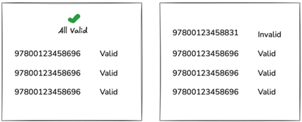
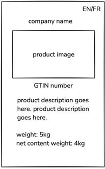

# Module A - Products Management

## Введение

Время на выполнение: **3 часа**

Мы собираемся создать систему управления для офисного администратора _(также известного как **админ**)_ для управления продуктами, произведёнными во Франции. Продукты принадлежат компаниям. Администратор также будет управлять данными, связанными с этими компаниями. Только администратор сможет просматривать и редактировать списки компаний и продуктов.
Каждая запись о продукте имеет уникальный идентификационный номер, который мы называем Глобальный Торговый Идентификационный Номер _(GTIN)_. В качестве справочной информации: GTIN разработан международной организацией GS1.

С другой стороны, есть страницы, доступные для широкой публики. Это:
- Публичная страница массовой проверки GTIN
- Публичная страница продукта

Использовать один из этих шаблонов:
- laravel
- express-js

Проект должен быть доступен по адресу: `http://module-a-YYYY.wsk.com`, где `YYYY` — ваш 4-значный PIN-код.

## Описание проекта и задач

В этом проекте мы создаём систему управления компаниями и продуктами для администратора.

Система включает веб-страницы для управления, позволяющие просматривать списки и редактировать записи. 

---

### Доступ администратора

Страница входа для администратора находится по пути `/login`. Страница входа запрашивает кодовую фразу для прохождения аутентификации. Для доступа к системе управления можно использовать кодовую фразу `admin`.

Поскольку это прототип, рассчитанный на **3 часа** работы, мы не требуем надёжной системы аутентификации. Система управления использует простую проверку на основе кодовой фразы.

Задача заключается в создании системы управления компаниями и продуктами.

Учитывая ограниченное время, мы сосредотачиваемся на создании прототипа управления записями о компаниях и продуктах, а также на демонстрации отображения продукта на публичной странице как **proof-of-concept**.

Попытка доступа к функциям редактирования и управления продуктами без входа в систему приведёт к ошибке `401 (Unauthorized)`.

### Управление компаниями

Только администратор может просматривать и управлять компаниями.
Администратор может щёлкнуть по компании в списке и просмотреть её подробности.
На странице каждой компании администратор может видеть связанные с ней продукты.
Также администратор может создавать новые компании или обновлять информацию о существующих.

Вот данные, которые мы хотим хранить и управлять для каждой компании:
- Название компании
- Адрес компании
- Номер телефона компании
- Адрес электронной почты компании
- Информация о владельце:
	- Имя владельца
	- Мобильный номер владельца
	- Электронная почта владельца
- Контактная информация:
	- Имя контактного лица
	- Мобильный номер контактного лица
	- Электронная почта контактного лица

### Деактивация компаний

Администратор может пометить компанию как деактивированную.
При деактивации компании все связанные с ней продукты автоматически помечаются как скрытые.
Должен быть отдельный список для отображения деактивированных компаний.
Удаление записей о компаниях через веб-интерфейс не допускается — ни один пользователь не должен иметь такой возможности.

### Управление продуктами

У каждого продукта есть несколько полей, и одно из важных — это GTIN.

В рамках этого проекта мы упрощаем GTIN до любого числа, содержащего 13 или 14 цифр. Это может быть любая последовательность цифр, при условии, что она уникальна для каждого продукта. Формат GTIN должен проверяться на сервере после отправки формы `(валидация на стороне сервера)`.

### Просмотр списка продуктов

Администратор должен иметь возможность просматривать и управлять продуктами.
При переходе по адресу `/products` администратор видит список всех продуктов.

Администратор может перейти на страницу управления конкретным продуктом, щёлкнув на запись в списке или перейдя по следующему адресу: `/products/[GTIN]`, где `[GTIN]` — это значение GTIN продукта.

Например, для продукта с GTIN 3000123456789, страница управления будет находиться по адресу: `/products/3000123456789`.

### Скрытие и удаление продуктов

Администратор может помечать продукты как скрытые.

Также продукт автоматически становится скрытым, если связанная с ним компания была деактивирована.

Скрытые продукты можно окончательно удалить — это может сделать только администратор.

### Создание новых продуктов

Администратор может открыть форму создания продукта, перейдя по адресу `/products/new`.

После заполнения формы администратор может сохранить новый продукт в базу данных.

Продукты содержат информацию на двух языках — `английском` и `французском`.

Для каждого продукта необходимо хранить следующие данные:
- Название продукта (на английском)
- Название продукта на французском
- GTIN (Глобальный торговый идентификационный номер)
- Описание (многострочный текст)
- Описание на французском
- Название бренда
- Страна происхождения продукта
- Вес брутто (с упаковкой)
- Вес нетто (без упаковки)
- Единица измерения веса

### Загрузка изображений продукта

У каждого продукта может быть одно изображение.

Администратор может загрузить или изменить изображение, а также удалить ранее загруженное изображение.

Если изображение не загружено, будет отображаться изображение-заглушка (по умолчанию).

### Публичные страницы

Существуют две публично доступные страницы:
1.	Страница массовой проверки GTIN
2.	Публичная страница продукта

### Страница массовой проверки GTIN

Эта страница позволяет проверять, зарегистрированы ли указанные GTIN-коды и действительны ли они. Любой пользователь может ввести сразу **несколько** GTIN-кодов и отправить их на проверку.

GTIN считается действительным, если он:
- существует в базе данных
- не помечен как скрытый

Функциональность страницы:

- Используется поле textarea, куда пользователь может вставить несколько GTIN-кодов (каждый код с новой строки)
- После отправки каждый код проверяется отдельно
- Результаты проверки отображаются в виде списка: напротив каждого GTIN отображается его статус (действителен или нет)
- Если все введённые GTIN-коды действительны, вверху страницы появляется сообщение `Все действительны` и зелёная галочка ✅

### Публичная страница продукта

Публичную страницу продукта можно открыть по адресу: `/01/[GTIN]` — где `01` является постоянным, а `[GTIN]` — это уникальный идентификатор продукта.

На странице должны отображаться следующие поля:
- Название компании
- Название продукта
- GTIN
- Описание продукта
- Изображение продукта
- Вес брутто с указанием единицы
- Вес нетто с указанием единицы

Дополнительные требования:
- Страница должна быть адаптирована для **мобильных устройств** (mobile-friendly layout)
- Пользователь может выбрать язык отображения — **английский** или **французский**
- Атрибут `lang` страницы, а также языковые блоки на странице, должны быть правильно настроены для английского (en) и французского (fr) языков.

---

## Инструкции для участников

Рекомендации по созданию базы данных и моделей:
- Мы хотим хранить данные о компаниях и продуктах в базе данных.
- Пожалуйста, учитывайте гибкость при хранении **многоязычной** информации о продуктах.
- Необходимо предоставить **дамп базы данных**.
- Дамп должен содержать внешние ключи _(FK-ограничения)_ и корректные столбцы.
- Типы столбцов должны быть логичными и обоснованными.
- Просьба учитывать **нормальные формы базы данных** при проектировании структуры.
- Поле GTIN должно быть **проиндексировано**.

Некоторые примерные данные уже предоставлены — пожалуйста, используйте их, чтобы база данных содержала записи для более удобной проверки и оценки.

## Прочее

Обязательно предоставьте файл с названием `expert_readme.txt`, в котором будет описано, как запускать и использовать ваш проект.

Даже если вы используете путь по умолчанию — этот файл всё равно обязателен.

Проект будет оцениваться с использованием браузера **Firefox Developer Edition**.