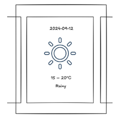

# Module B - Mobile Web Service

## Введение

Время на выполнение: **2 часа**

В этом проекте мы собираемся создать мобильный веб-сайт, который предоставляет данные об основных сервисах города. Веб-сайт запрашивает динамические данные через имитированный сервер API. Этот сервер уже создан и предоставлен вам.

API доступен по адресу: http://module-b-api.wsk.com

Использовать один из этих шаблонов:
- react
- vue-js

Проект должен быть доступен по адресу: `http://module-b-YYYY.wsk.com`, где `YYYY` — ваш 4-значный PIN-код.

## Описание проекта и задач

**Макет мобильного веб-интерфейса:**
- Существует верхняя панель (header bar), основное содержимое (main content) и навигационная панель (navigation bar).
- Верхняя панель всегда закреплена в верхней части экрана.
- Навигационная панель всегда закреплена в нижней части экрана.
- Когда основное содержимое превышает высоту видимой области **(viewport)**, прокрутка происходит только для основного содержимого. Верхняя и нижняя панели остаются на месте.
- Верхняя панель может отображать заголовок текущего экрана и предоставлять возможность вернуться назад.

**В навигационной панели расположены 4 кнопки:**
1. Carparks
2. Events
3. Weather
4. Setting

**API данных:**
- /carparks.json
- /events.json
- /weather.json

**Постраничная навигация (пагинация):**
API событий поддерживает пагинацию.

Вы можете найти URL следующей страницы в следующей структуре:
```js
{
	"pages": {
		"next": "xxxxx",
		"prev": "xxxxx"
	}
}
```

---

### Страница - Доступные парковки

Первая кнопка в навигационной панели отвечает за отображение информации о доступности парковок.

Мобильный веб-сайт должен отображать список записей о парковках. В каждой записи указывается количество свободных мест.

**Сортировка:**

Существует переключатель для смены способа сортировки:
- по алфавиту
- по расстоянию от текущего местоположения до каждой парковки

Настройка выбора сортировки находится во вкладке настроек _(четвёртая кнопка в навигационной панели)_.

**Геолокация и её симуляция:**

Для симуляции местоположения доступны два способа:
- Установка координат вручную через URL
- Использование инструмента разработчика Chrome _(Geolocation Dev Tool)_

Пример установки координат вручную:

Пользователь может добавить параметры **latitude** и **longitude** в строку URL:
`?latitude=45.755051&longitude=4.846358` — чтобы задать геолокацию вручную.

JavaScript-код (`/media/module-b/geolocation_distance.js`) для вычисления расстояния между координатами предоставлен.

Приложение должно по умолчанию пытаться получить текущую геолокацию пользователя.

Если браузер блокирует этот запрос по причинам безопасности или в рамках условий среды соревнования, оценка будет производиться по исходному коду, реализующему функцию получения геолокации.

**Фокусировка на парковке:**

Пользователь может нажать на парковку в списке, чтобы перейти в режим фокусировки.

В этом режиме отображаются только:
- Название парковки
- Расстояние
- Количество доступных мест

Пользователь может вернуться к списку парковок из этого режима.

**Закрепление парковки вверху списка:**

Парковку можно закрепить _(и открепить)_ в верхней части списка, вне зависимости от выбранного способа сортировки.

Статус закрепления должен сохраняться в локальное хранилище браузера и **восстанавливаться** при обновлении страницы.

### Страница - События

Вторая кнопка в навигационной панели ведёт к списку событий (Event List).

Сначала отображается **несколько** событий — они получены по умолчанию из API. События выводятся сверху вниз.

Каждая запись о событии должна содержать:
- изображение
- название события
- дату проведения

**Запрос данных о событиях:**

Список событий можно фильтровать по дате начала и окончания.

Для этого доступны два поля ввода:
- дата начала
- дата окончания

После выбора даты начала и/или окончания список автоматически обновляется, отображая результаты нового запроса.

Формат запроса к API:
`/events.json?beginning_date=YYYY-MM-DD&ending_date=YYYY-MM-DD`

**Бесконечная прокрутка (Infinite scrolling):**

Когда пользователь прокручивает страницу до конца списка, автоматически загружаются и отображаются следующие события.

Требования:
- Прокрутка должна быть плавной и отзывчивой.
- Загрузка новых данных не должна происходить слишком рано (не жадничать), и не должна быть слишком поздней _(не лагать)_.
- Корректная работа с данными:
	- Не должно быть дубликатов событий
	- Не должно быть пропущенных событий

Реализация должна обеспечивать качественный пользовательский опыт при прокрутке и загрузке новых данных.

### Страница - Погода

Третья кнопка в навигационной панели отвечает за раздел погоды.

В этом разделе отображается прогноз погоды на предстоящую неделю — всего 7 дней.

**Горизонтальная прокрутка:**

- Прогноз погоды организован в горизонтальную ленту.
- При горизонтальной прокрутке погода должна **прилипать** к дням недели (snap-to-day).
- Это обеспечивает удобную и аккуратную навигацию между днями прогноза.



**SVG-иконки:**

Для каждого дня недели используется SVG-иконка, соответствующая погодным условиям этого дня.

Информация о том, какую иконку использовать, указывается в JSON-ответе от API.

**Анимация при наведении курсора:**

При наведении мыши на SVG-иконку активируется анимированный эффект обводки (stroke effect).

Параметры SVG:
- Цвет обводки: `#1c3e60`
- Толщина обводки: `1`
- Без заливки (`fill: none`)

Эффекты анимации:
- stroke `dash-array`: от 50 до 200 за 2 секунды
- stroke `dash-offset`: от 200 до 0

Анимация должна создавать эффект прорисовки иконки, как будто она **рисуется** в реальном времени.

### Страница - Настройки

Четвёртая кнопка в навигационной панели открывает раздел настроек.

**Темная тема:**

В настройках доступен выбор темы оформления:
- Светлая тема
- Темная тема
- Следовать системной настройке (автоматическое переключение в зависимости от настроек операционной системы)

**Метод сортировки парковок:**

Также в настройках есть переключатель сортировки парковок:
- По алфавиту
- По расстоянию (от текущего местоположения до парковки)

Пользователь может свободно настраивать оба параметра в соответствии со своими предпочтениями.

---

## Инструкции для участников

**Конфигурация мобильного веб-приложения:**

Пожалуйста, настройте файл `manifest.json` и необходимые метатеги для мобильных веб-систем Android и iOS.

Также настройте **viewport** для удобного отображения на мобильных устройствах.

**Доступность:**

Убедитесь, что приложение соответствует стандартам доступности. Мы будем оценивать результат с помощью **Chrome Lighthouse** по доступности.

Также убедитесь, что ваш **JavaScript** код легко поддерживаем.

**Прочее:**

Проект будет оцениваться с использованием веб-браузера **Google Chrome**.

Вы можете предоставить файл `README.md` с инструкциями по запуску, если это необходимо.